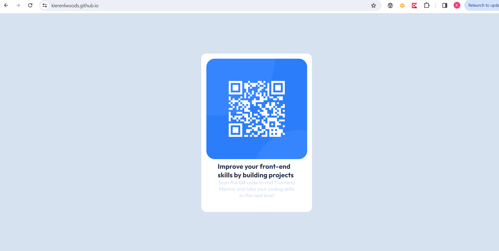

# Frontend Mentor - QR code component solution

This is a solution to the [QR code component challenge on Frontend Mentor](https://www.frontendmentor.io/challenges/qr-code-component-iux_sIO_H). Frontend Mentor challenges help you improve your coding skills by building realistic projects. 

## Table of contents

- [Overview](#overview)
  - [Screenshot](#screenshot)
  - [Links](#links)
- [My process](#my-process)
  - [Built with](#built-with)
- [Author](#author)

## Overview
This is my attempt at the qr-code component challenge.
### Screenshot

### Links

- Solution URL: (https://github.com/KierenLWoods/KierenLWoods.github.io)
- Live Site URL: (https://kierenlwoods.github.io/)

## My process

### Built with

- HTML5
- CSS 

## Author

- Github - [KierenLWoods](https://github.com/KierenLWoods)
- Frontend Mentor - [@KierenLWoods](https://www.frontendmentor.io/profile/KierenLWoods)